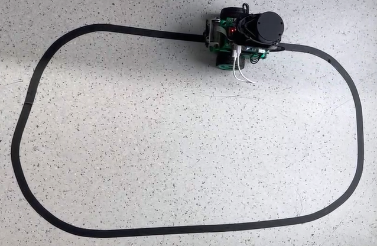

[English](./README.md) | 简体中文

# 功能介绍

巡线任务，即机器人小车能够自主跟着一条引导线向前运行，引导线往左，小车也跟着往左转，引导线往右，小车跟着往右转。该任务是轮式机器人中比较基础的任务，实现方式也有多种，比如：

- 通过安装多个光电传感器（灰度传感器），根据传感器的的返回值判断该传感器是否位于线上，进而调整机器人运动方向
- 通过摄像头基于传统的图像处理方法如边缘检测等获取线在图像中的位置，进而调整机器人运动方向

上述常用方法当光照环境、场地发生变化，一般需要反复通过采集图像调整阈值以及进行测试来实现比较好的识别结果。那有没有可能让机器人能够自行适应环境的变化，不再需要人为的调整阈值呢？卷积神经网络（CNN），是深度学习算法应用最成功的领域之一，具有不错的适应性和鲁棒性，近年来随着处理器的快速发展，已经可以在嵌入式端进行CNN推理，这里使用CNN的方式实现巡线任务中引导线的位置感知。

# 物料清单

以下机器人均已适配RDK X3

| 机器人名称          | 生产厂家 | 参考链接                                                     |
| :------------------ | -------- | ------------------------------------------------------------ |
| OriginBot智能机器人 | 古月居   | [点击跳转](https://www.originbot.org/)                       |
| X3派机器人          | 轮趣科技 | [点击跳转](https://item.taobao.com/item.htm?spm=a230r.1.14.17.55e556912LPGGx&id=676436236906&ns=1&abbucket=12#detail) |
| 履带智能车          | 微雪电子 | [点击跳转](https://detail.tmall.com/item.htm?abbucket=9&id=696078152772&rn=4d81bea40d392509d4a5153fb2c65a35&spm=a1z10.5-b-s.w4011-22714387486.159.12d33742lJtqRk) |
| RDK X3 Robot        | 亚博智能 | [点击跳转](https://detail.tmall.com/item.htm?id=726857243156&scene=taobao_shop&spm=a1z10.1-b-s.w5003-22651379998.21.421044e12Yqrjm) |

# 使用方法

## 准备工作

1. 机器人具备运动底盘、相机及RDK套件，硬件已经连接并测试完毕；
2. 已有ROS底层驱动，机器人可接收“/cmd_vel”指令运动，并根据指令正确运动。

## 机器人组装
以下操作过程以OriginBot为例，满足条件的其他机器人使用方法类似。参考机器人官网的[使用指引](https://www.originbot.org/guide/quick_guide/)，完成机器人的硬件组装、镜像烧写及示例运行，确认机器人的基础功能可以顺利运行。

## 安装功能包
**1.参考[OriginBot说明](https://github.com/nodehubs/originbot_minimal/blob/develop/README.md)，完成Originbit基础功能安装**

**2.安装功能包**

启动机器人后，通过终端SSH或者VNC连接机器人，点击本页面右上方的“一键部署”按钮，复制如下命令在RDK的系统上运行，完成相关Node的安装。

```bash
sudo apt update
sudo apt install -y tros-line-follower-perception
sudo apt install -y tros-line-follower-model
```

**3.运行巡线功能**

```shell
source /opt/tros/local_setup.bash
ros2 run line_follower_perception line_follower_perception --ros-args -p model_path:=/opt/tros/share/line_follower_perception/resnet18_224x224_nv12.bin -p model_name:=resnet18_224x224_nv12
```

运行mipi_cam

```powershell
source /opt/tros/local_setup.bash
ros2 launch mipi_cam mipi_cam.launch.py
```

最后进入小车的运动控制package，originbot_base运行

```powershell
source /opt/tros/local_setup.bash
ros2 launch originbot_base robot.launch.py 
```
用PVC胶带搭建场景，巡线效果图如下图：


# 原理简介


整套系统如上图所示，地平线RDK通过摄像头获取小车前方环境数据，图像数据通过训练好的CNN模型进行推理得到引导线的坐标值，然后依据一定的控制策略计算小车的运动方式，通过UART向小车下发运动控制指令实现整个系统的闭环控制。

PC用于进行数据标注以及训练，为了提高效率这里采用地平线RDK将图片通过以太网发送至PC端进行标注的方式。


整个软件工程包括5个主要环节分别是：

- 数据采集与标注，根据任务目标获取相应的数据并进行标注，用于模型训练；
- 模型选择，根据任务目标选取合适的模型结构确保性能和精度都能够满足需要；
- 模型训练，使用标注的数据对模型进行训练，以达到满意的精度要求；
- 模型转换，使用算法工具链将训练得到的浮点模型转换为可以在地平线RDK上运行的定点模型；
- 端侧部署，在地平线RDK上运行转换后的模型，得到感知结果并控制机器人运动

系统工作流程如下：


# 接口说明

## 话题

### Pub话题

| 名称                          | 消息类型                                                     | 说明                                                   |
| ----------------------------- | ------------------------------------------------------------ | ------------------------------------------------------ |
| /cmd_vel                      | geometry_msgs/msg/Twist                                      | 发布控制机器人移动的速度指令                           |
| /hbmem_img                      | rcl_interfaces/msg/HobotMemoryCommon                                      | 发布图像数据                           |
| /camera_info                      | sensor_msgs/msg/CameraInfo                                      | 发布camera标定信息等                           |

## 参数

| 参数名                | 类型        | 解释                                                                                                                                  | 是否必须 | 支持的配置           | 默认值                                               |
| --------------------- | ----------- | ------------------------------------------------------------------------------------------------------------------------------------- | -------- | -------------------- | ---------------------------------------------------- |
| model_path       | std::string | 推理使用的模型文件                                                                                                                  | 否       | 根据实际模型路径配置 | ./resnet18_224x224_nv12.bin |
| model_name       | std::string | 推理使用的模型文件名字                                                                                                                   | 否       | 根据实际模型路径配置 | resnet18_224x224_nv12.bin |


# 参考资料

基于CNN的巡线小车：[深度巡线小车](https://developer.horizon.cc/documents_tros/tros_dev/line_follower)
